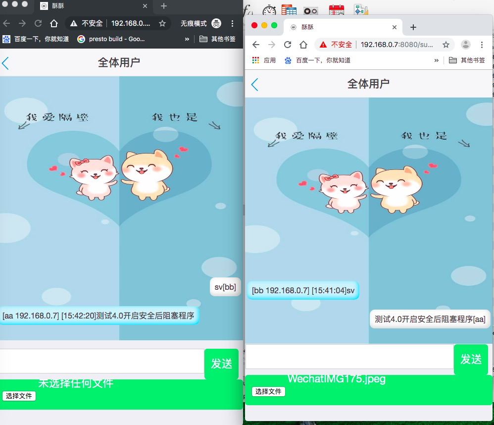

# 1. 首先建立一个本地库


# 2.导入相关的表信息

导入文件在：InChat/sql/nettychat.sql

# 3. 修改配置

```java
spring:
  datasource:
    driver-class-name: com.mysql.jdbc.Driver
    username: root
    password: xxx
    url: jdbc:mysql://192.168.0.7:3306/nettychat?characterEncoding=utf-8&useSSL=false
```

主要修改用户名和密码，以及连接地址

# 4.全局查找修改IP

将ip替换成你自己的IP

```
192.168.0.7
```

# 5.运行主类

```
NettychatApplication
```

# 6.页面登录

<http://192.168.0.7:8080/susu/chat/netty?>

# 7.效果图




